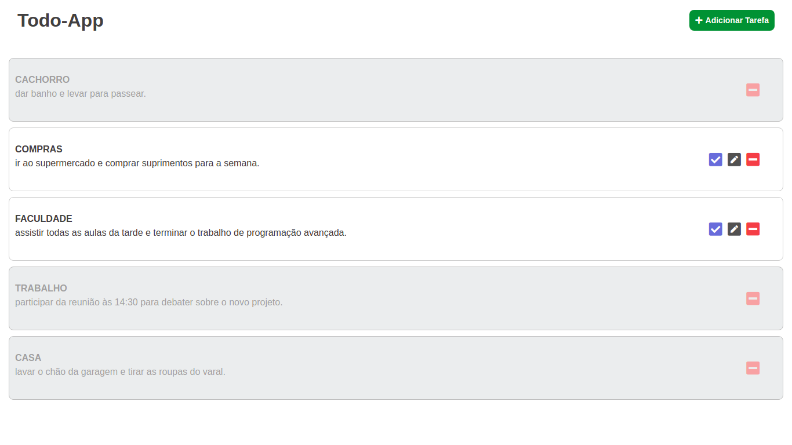

<h1 align="center">
    
</h1>

<hr>

## :memo: Project
The project is a system of tasks, in which the user can add his to-do, mark as soon as he finishes, make changes to his tasks and delete as soon as he wants.

<hr>

## :computer: Technologies used

:zap: FRONT-END

:pushpin: HTML

:pushpin: CSS

:pushpin: EJS Engine

<br />

:zap: BACK-END

:pushpin: NodeJs

:pushpin: Express

:pushpin: Mongoose

:pushpin: Javascript

<br />

:zap: DATABASE

:pushpin: Mongodb

<hr>

## :rocket: How to use?

:heavy_check_mark: Clone project and access its folder.

```bash
$ git clone https://github.com/jtiagosantos/todo-app.git
$ cd todo-app
```

:heavy_check_mark: Create your own cluster in Mongodb Atlas.

:heavy_check_mark: Create an .env file at the root of project.

:heavy_check_mark: Paste the code below into .env file.

```bash
CONNECTIONSTRING=your cluster connection url
```

:heavy_check_mark: To start it, follow the steps below:

```bash
# Install dependencies
$ npm install

# Start project
$ npm start
```

The app will be available in your browser at the address http://localhost:3000.

<hr>

:man_technologist: Made with :heart: by Tiago Santos.
